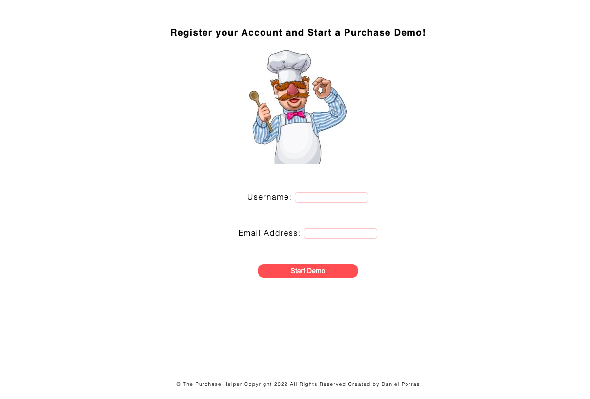
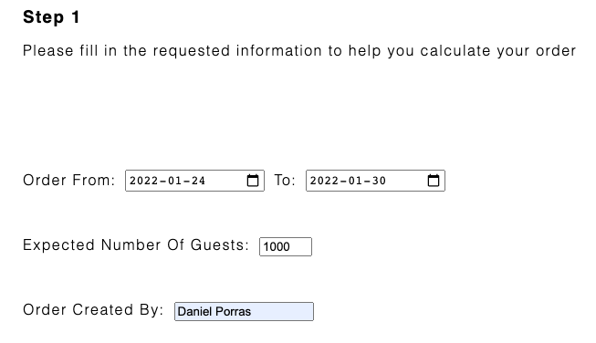
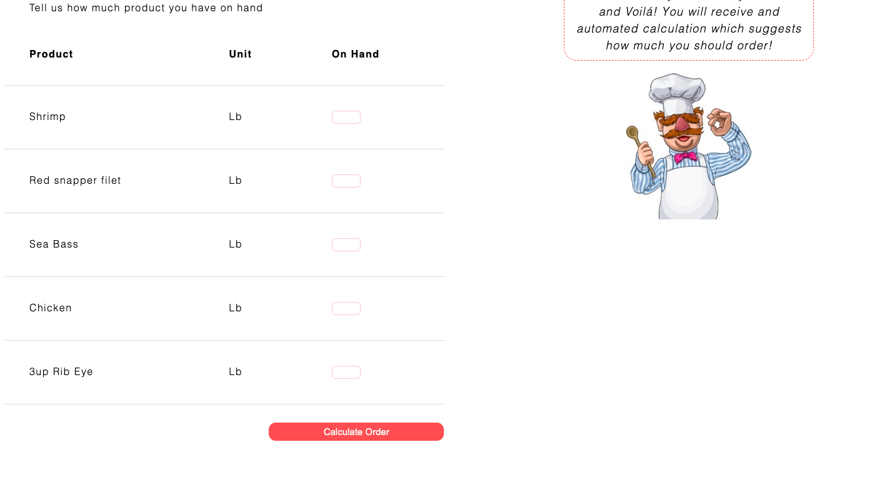

## The Purchase Helper 

* Small businesses often struggle to get their orders on point. Sometimes they buy too little and sometimes they
  buy too much. In both cases there are costs attached with having a wrong purchasing strategy. We have created an
  analytical tool that will help you calculate your orders in a more accurate way. Tell us how many guests you are expecting and how much product you have on hand and we will suggest you how you need to order.

  I have personally experienced this since I am currently owner of three restaurant businesses. They all have a management team and a kitchen head and constantly they get the ordering incorrectly. This only affects businesses and clients in general. This is why I thought this could be a good idea. 
  
 

 ## UX 

### The Purchase Helper 

* We make a series of calculations taking into consideration different parameters. We check the selling
history of a restaurant business to identify the % share for every dish you are selling. We also anayze how much quantity of each
product you add to every recipe. With that, we just add how many guests you are expecting to visit your
business in a period of time and how much you have in your stock and Voilá! You will receive and automated
calculation which suggests how much you should order.

### User Stories
* As a user I want to easily understand the information of what the page can do.
* As a user I want to easily find an efficient path to test the tool.
* As a user I want to see how this could be useful for my business.
* As a user I want to find the page very easy for my team to use. 
* As the organisation we want to tell how useful this tool can be for small and medium businesses
* As the organisation we want to be reliable and offer real solutions to real management problems.

 ## Features

 

 ### Login Page

 * This page introduces you to the purchase order tool and explains you the concept. It also asks you to login and to run a demo to understand better how the page works. 

 

 ### Calculation Page

 * This page was built in a very straight forward way. When the page loads, a chef pops up to give you more information about how the Purchase Helper works. The idea is to fill up the information fields required, which is what I considered are the essential elements required to run calculations. A start and end dates are set to measure the amount of days you are placing an order for. Afterwards, a projection of clients in this period of time visiting your business is required. Then there is a Created By field and we pass to the On Hand table. Here the user will fill up how much of each product they have got on their stock. With the projection of guests and the on hand details, we can run the functions placed in the back with the "Calculate Order" button. This will call all the arithmetic operators placed in different functions in the JavaScript files. 

 

 

  
