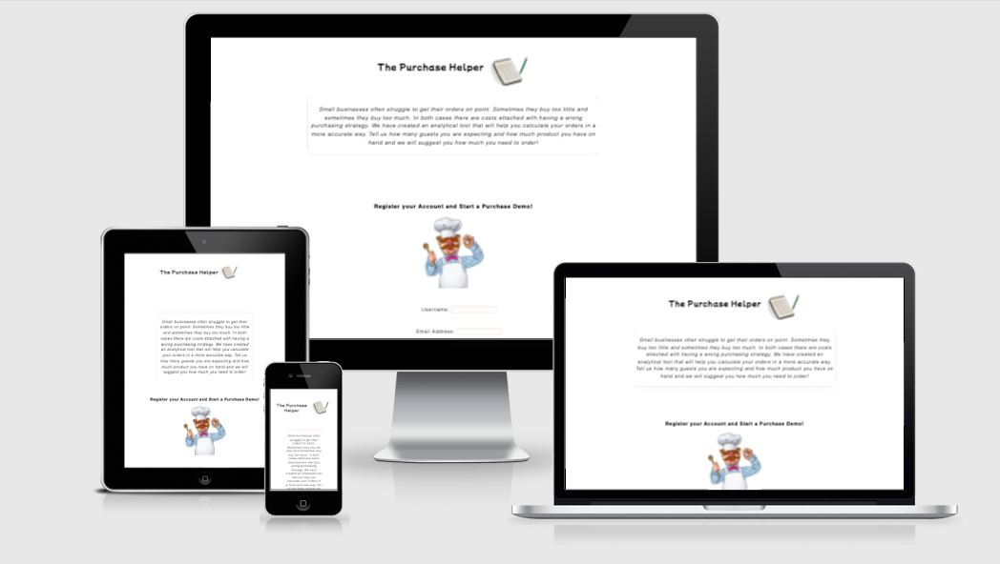

## The Purchase Helper 

* Small businesses often struggle to get their orders on point. Sometimes they buy too little and sometimes they
  buy too much. In both cases there are costs attached with having a wrong purchasing strategy. We have created an
  analytical tool that will help you calculate your orders in a more accurate way. Tell us how many guests you are expecting and how much product you have on hand and we will suggest you how you need to order.

  I have personally experienced this since I am currently owner of three restaurant businesses. They all have a management team and a kitchen head and constantly they get the ordering incorrectly. This only affects businesses and clients in general. This is where I thought this could be a good idea. 
  
 

 ## UX 

### The Purchase Helper 

* We make a series of calculations taking into consideration different parameters. We check the selling
history of a restaurant business to identify the % share for every dish you are selling. We also anayze how much quantity of each
product you add to every recipe. With that, we just add how many guests you are expecting to visit your
business in a period of time and how much you have in your stock and Voilá! You will receive and automated
calculation which suggests how much you should order.

### User Stories
* As a user I want to easily find general information about the hotel.
* As a user I want to easily find visual content that shows as much as possible about the facilities.
* As a user I want to easily find out more about the hotel through social media icons that take me to different social media content where I can learn more about the hotel. 
* As a user I want to easily contact through phone or email someone about booking a stay
* As the organisation we want to promote direct bookings avoiding intermediaries.
* As the organisation we want to promote our social media channels that offer almost infinite content.
* As the organisation we want to be able to tell a nice story about what the Aáki Hotel experience is all about.

 ## Features

 

 ### Navigation

 * The navigation bar features a common design across all pages displaying the logo on the left side and the navigation links on the center and right sides.
  * The navigation bar includes links on the logo, Home, Rooms, Eat & Drink, and linkable social media icons and email address. The various title links head to their respective pages for easy navigation. 
  * The navigation bar is fully responsive, for smaller screens, the format of the bar changes to a column orientation with the logo at the top centered on the page and the title links vertically aligned underneath. For tablets and screens in between there is a staggered change through the use of media queries in order to maximise its size.
  * An underline appears on the active page as a visual indicator to the user as to which page they are currently on. With a line appearing underneath the text on hover to visually indicate to users that they are clickable.
