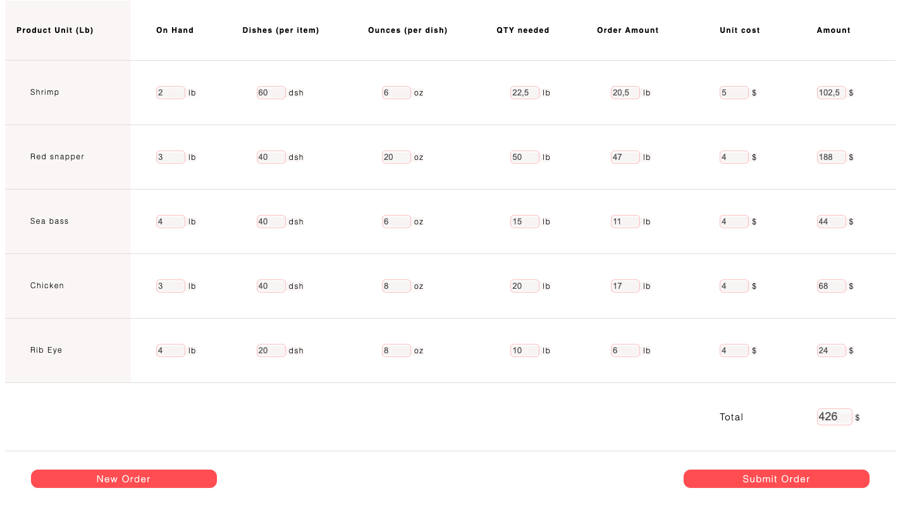

## The Purchase Helper 

* Small businesses often struggle to get their orders on point. Sometimes they buy too little and sometimes they
  buy too much. In both cases there are costs attached with having a wrong purchasing strategy. We have created an
  analytical tool that will help you calculate your orders in a more accurate way. Tell us how many guests you are expecting and how much product you have on hand and we will suggest you how you need to order.

  I have personally experienced this since I am currently owner of three restaurant businesses. They all have a management team and a kitchen head and constantly they get the ordering incorrectly. This only affects businesses and clients in general. This is why I thought this could be a good idea. 
  
 

 ## UX 

### The Purchase Helper 

* We make a series of calculations taking into consideration different parameters. We check the selling
history of a restaurant business to identify the % share for every dish you are selling. We also anayze how much quantity of each
product you add to every recipe. With that, we just add how many guests you are expecting to visit your
business in a period of time and how much you have in your stock and Voilá! You will receive and automated
calculation which suggests how much you should order.

### User Stories
* As a user I want to easily understand the information of what the page can do.
* As a user I want to easily find an efficient path to test the tool.
* As a user I want to see how this could be useful for my business.
* As a user I want to find the page very easy for my team to use. 
* As the organisation we want to tell how useful this tool can be for small and medium businesses
* As the organisation we want to be reliable and offer real solutions to real management problems.

 ## Features

 

 ### Login Page

 * This page introduces you to the purchase order tool and explains you the concept. It also asks you to login and to run a demo to understand better how the page works. 

 

 ### Calculation Page

 * This page was built in a very straight forward way. When the page loads, a chef pops up to give you more information about how the Purchase Helper works. The idea is to fill up the information fields required, which is what I considered are the essential elements required to run calculations. A start and end dates are set to measure the amount of days you are placing an order for. Afterwards, a projection of clients in this period of time visiting your business is required. Then there is a Created By field and we pass to the On Hand table. Here the user will fill up how much of each product they have got on their stock. With the projection of guests and the on hand details, we can run the functions placed in the back with the "Calculate Order" button. This will call all the arithmetic operators placed in different functions in the JavaScript files. 

 

### Order Created Page

* This page will throw the information of fields filled up in the calculation page and place them automatically. The table below will show the results of the arithmetic operations generated as a consequence of  filling up the information on the calculation page. The table contains a lot of detailed information which are needed to be able to get the total amoount results. The tool will always need certain constant values in order to function. I declared these values in objects in order to execute the operations. This would be adapted to the information of different restaurant businesses. Below the table, the user will find two buttons. One the offers to create a new order and the second button offers to submit the order. By clicking this button an order will be generated and sent for approval (this feature is not working at the moment. It only takes you to another page for demo).

### Order Generated Page

* This page shows a confirmation message that your order has been approved and that an email has been sent to the manager in charge of approving the order. It also generates an order number when the page loads. In the future the orders generated will have a proper numeric system in order to be able to keep track. 

### Common Features

## Footer

* The only common feature to all pages is the footer which contains a Copyright messsage.

### Features Left to Implement

* A nicer layout for the entire page.
* A FAQ page.
* An educational video on how the calculations are ran.
* An option to load measurements in kilos aside from the punds option.
* The possibility to have users filling up their own information to run the system independently.

### Testing

* For this project I considered the need to make the tool very efficient. Often I find pages very difficult to navigate and to get to the point of the product that is being offered. I was constantly running the operations on the chrome developer tools to see if the functions where connected properly. Since I wanted the results of the calculations to appear in a different page, I struggled a lot with finding the correct function to pass the values from one html and js files to another. I spent several days figuring this out until I found a solution in StackOverflow. I also had to change the position of some of the columns in order to improve the user experience. This also meant I had to change the Id's of many elements. 

* In order to add the correct responsiveness I added media queries for three different sizes.

* My goal is to make a more efficient document. I targetted the elements mainly by their Id's since I felt I could identify them better but I expect I can adjust the functions with for loops. 

* Testing was performed with the following devices/browsers:
  * MacBook Air computer: 1280 x 800 
    * Google Chrome
    * Firefox
    * Microsoft Edge
    * Kindle Fire HDX: 800 x 1200
  * iPad Air: 1536 x 2048 display
    * iOS Safari
  * iPhone 11 x pro: 414 x 896 display
    * iOS Safari

I also tested the site with the Chrome and Firefox developer tools to simulate the display on other devices and test the responsiveness of the site.

### Validator Testing

* HTML 

* No errors returned when passing through the official W3C Validator.

* Index.html 
* Calculations.html 
* Order.html 
* Approval.html 

* CSS

* No errors returned when passing through the official Jigsaw Validator.

* Css Style 

* JavaScript

* No errors returned when passing through the official JSHint Validator.

* Calculate.js 
* Order.js   
* Approval.js  

 

  
